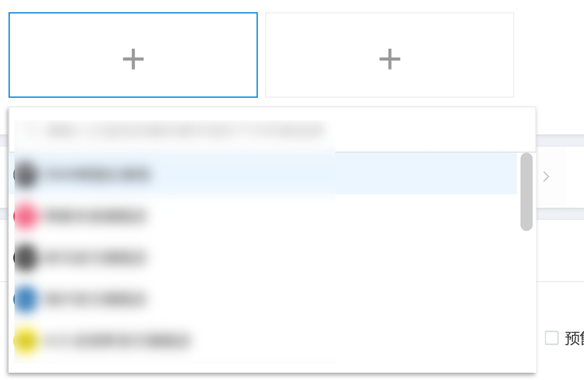
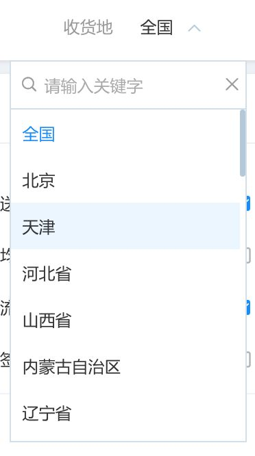

# 重新设计 React 组件库
在 react + redux 已经成为大部分前端项目底层架构的今天，让我们再回到软件工程界一个永恒的问题上来，那就是如何提升一个开发团队的开发效率？
从宏观的角度来讲，只有对具体业务的良好抽象才能真正提高一个团队的开发效率，又囿于不同产品所面临的不同业务需求，当我们抽丝剥茧般地将一个个前端项目抽象到最后一层，那么剩下的就只有按钮、输入框、对话框、图标等这些毫无业务意义的纯 UI 组件了。

选择或开发一套适合自己团队使用的 UI 组件库应该是每一个前端团队在底层架构达成共识后下一件就要去做的事情，那么我们就以今天为始，分别从以下几个方面来探讨如何构建一套优秀的 UI 组件库。

## 第一个问题：选择开源 vs 自己造轮子
在 React 界，优秀且开源的 UI 组件库有很多，国外的如 [Material-UI](http://www.material-ui.com/)，国内的如 [Ant Design](https://ant.design/)，都是经过众多使用者检验，组件丰富且代码质量过硬的组件库。所以当我们决定再造一套 UI 组件库之前，不妨先尝试下这些在 UI 组件库界口碑良好的标品，再决定是否要进入这个看似简单实则困难重重的领域。

在这里，我们并不会去比较任何组件库之间的区别或优劣，但却可以从产品层面给出几个开发自有组
件库的判断依据，以供参考。

* 产品有独立的设计规范，包括但不限于组件样式、交互模式。
* 产品业务场景较为复杂，需要深度定制某些常用组件。
* 前端团队需要同时支撑多条业务线。

## 设计思想：规范 vs. 自由
在选择了自己造轮子这样一条路之后，下一个摆在面前的艰难选择就是，要造一个规范的组件库还是一个自由的组件库？

规范的组件库可以从源码层面保证产品视觉、交互风格的一致性，也可以很大程度上降低业务开发的复杂度，从而提升团队整体的开发效率。但在遇到一些看似相似实则不同的业务需求时，规范的组件库往往会走入一个难以避免的死循环，那就是实现 A 需求需要使用 a 组件，但是现有的 a 组件又不能完全支持 A 需求。

这时摆在工程师面前的就只有两条路：
* 重新开发一个完美支持 A 需求的 a+ 组件
* 修改 a 组件源码使其支持 A 需求

方法一费时费力，会极大地增加本次项目的开发成本，而方法二又会导致 a 组件代码膨胀速度过快且逻辑复杂，极大地增加组件库后期的维护成本。

在多次陷入上面所描述的这个困境之后，在最近的一次内部组件库重构时，我们选择了拥抱自由，这其中既有业务方面的考虑，也有 React 在组件自由组合方面的天然优势，让我们来看一个例子。

### Select

```javascript
// traditional select
<div className={dropdownClass}>
  <div
    className={`${baseClassName}-control ${disabledClass}`}
    onMouseDown={this.handleMouseDown.bind(this)}
    onTouchEnd={this.handleMouseDown.bind(this)}
  >
    {value}
    <span className={`${baseClassName}-arrow`} />
  </div>
  {menu}
</div>
```

这是一个非常传统的 Select 组件，触发下拉菜单的区域为一段文字加一个箭头。我们来看下面的一个业务场景：



这里触发下拉菜单的区域不再是传统的一段文字加一个箭头，而是一个自定义元素，点击后展开下拉列表。虽然它的交互模式和 Select 一模一样，但因为二者在 DOM 结构上的巨大差别，导致我们无法复用上面的这个 Select 来实现它。

```javascript
// Customizeable Select
<div {...filterProps} className={classes} onClick={::this.handleInnerClick}>
  {
    children
    ||
      <span>
        <span className={`${prefixCls}-container`}>
          {label ? <span className={`${prefixCls}-container-label`}>{label}</span> : null}
          <span className={`${prefixCls}-container-value`} style={valueStyle}>
            {currentValue !== '' ? currentValue : selectPlaceholder}
          </span>
        </span>
        <Icon className={iconClasses} name="angle-down" />
      </span>
  }
  {this.renderPopup()}
</div>
```

在支持传统的文字加箭头之外，更自由的 Select 添加了对 label 及 children 支持，分别可以对应有名称的 Select



及类似前面提到的自定义元素。

### Dropdown

类似的还有 Select 的孪生兄弟 Dropdown。

```javascript
// Customizeable Dropdown
<div {...filterProps} className={classes}>
  {data.map((value, idx) => {
    return (
      <ItemComponent
        data={value} key={idx} datas={data}
        className={itemClasses}
        onClick={onSelect.bind(null, value, idx)}
        onMouseOver={onMouseOver.bind(null, value, idx)}
      />
    );
  })}
</div>

// Using Dropdown
const demoData = [{ text: 'Robb Stark', age: 36 }]
const DropdownItem = (props) => (
  <div {...props}>
    <div>{props.data.text}</div>
    <div>is {props.data.age} years old.</div>
  </div>
);
```

这是一个常见的下拉列表组件，是否允许用户传入 ItemComponent 其实就是一个规范与自由之间的取舍。在选择了拥抱自由之后，组件的使用者终于不会再被组件内部的 DOM 结构所束缚，转而可以自由地定制子元素的 DOM 结构。

相较于传统的规范的组件，自由的组件需要使用者在业务项目中多写一些代码，但如果我们往深处再看一层，这些特殊的下拉元素本就是属于某个业务所特有的，将其放在业务代码层恰恰是一种更合适的分层方法。

另一方面，我们在这里所定义的自由，绝不仅仅是多暴露几个渲染函数那么简单，这里的自由指的是组件内部 DOM 结构的自由。因为一旦某个组件定死了自己的 DOM 结构，外部使用时除了重写样式去强行覆盖外没有任何其他可行的方式去改变它。

虽然我们上面提到了许多自由的好处，但很多时候我们还是会被一个问题所挑战，那就是自由的组件在大部分时候不如规范的组件来得好用，因为调用起来很麻烦。

这个问题其实是有解的，那就是默认值。我们可以在组件库中内置许多常用的子元素，当用户不指定子元素时，使用默认的子元素来完成渲染，这样就可以在规范与自由之间达成一个良好的平衡，但这里需要注意的是，添加常用子元素的工作量也非常巨大，团队内部也需要对“常用”这个词有一个统一的认识。

或者你也可以选择针对不同的使用场景，做两套不同的解决方案。例如前端开源 UI 框架界的翘楚 antd，其底层依赖的 [react-component](https://github.com/react-component) 也是非常解耦的设计，几乎看不到任何固定的 DOM 结构，而是使用自定义组件或 children prop 将 DOM 结构的决定权交给使用者。

```javascript
// react-component/dropdown
return (
  <Trigger
    {...otherProps}
    prefixCls={prefixCls}
    ref="trigger"
    popupClassName={overlayClassName}
    popupStyle={overlayStyle}
    builtinPlacements={placements}
    action={trigger}
    showAction={showAction}
    hideAction={hideAction}
    popupPlacement={placement}
    popupAlign={align}
    popupTransitionName={transitionName}
    popupAnimation={animation}
    popupVisible={this.state.visible}
    afterPopupVisibleChange={this.afterVisibleChange}
    popup={this.getMenuElement()}
    onPopupVisibleChange={this.onVisibleChange}
    getPopupContainer={getPopupContainer}
  >
    {children}
  </Trigger>
);
```

## 数据处理：耦合 vs. 解耦
如果你问一个工程师在某个场景下，两个模块是耦合好还是解耦好？我想他甚至可能都不会问你是什么场景就脱口而出：“当然解耦好，耦合的代码根本没办法维护！”

但事实上，在传统的组件库设计中，我们一直都默认组件是可以和数据源（一般的组件都会有 data 这个 prop）相耦合的，这样就导致了我们在给某个组件赋值之前，要先写一个数据处理方法，将后端返回回来的数据处理成组件要求的数据结构，再传给组件进行渲染。

这时，如果后端返回的或组件要求的数据结构再变态一些（如数组嵌套），这个数据处理方法就很有可能会写得非常复杂，甚至还会导致许多的 edge case 使得组件在获取某个特定的 attribute 时直接报错。

如何将组件与数据源解耦呢？答案就是不要在组件代码（不论是视图层还是控制层）中出现 `data.xxx`，而是在回调时将整个对象都抛给调用者供其按需使用。这样组件就可以无缝适配于各种各样的后端接口，大大降低使用者在数据处理时犯错误的可能。

承接前文，其实这样的数据处理方式和前面提到的自由的设计思想是一脉相承的，正是因为我们赋予了使用者自由定制 DOM 结构的能力，所以我们同时也可以赋予他们在数据处理上的自由。

看到这里，支持规范组件的朋友可能已经有些崩溃了，因为听起来自由组件既不定义 DOM 结构，也不处理数据，那么我为什么还要用这个组件呢？

让我们以 Select 组件为例来回答这个问题。

是的，自由的 Select 组件需要使用者自定义下拉元素，还需要在回调中自己处理使用 data 的哪个 attribute 来完成下一步的业务逻辑，但 Select 组件真的什么都没有做吗？其实并不是，Select 组件规范了“选择”这个交互方式，处理了什么时候显示或隐藏下拉列表，响应了下拉列表元素的 `hover` 和 `click` 事件，并控制了绝对定位的下拉列表的弹出位置。这些通用的交互逻辑，才是 Select 组件的核心，至于多变的渲染和数据处理逻辑，打包开放出来反而更利于使用者在多变的业务场景下方便地使用 Select 组件。

讲完了组件与数据源之间的解耦，我们再来谈一下组件各个 props 之间解耦的必要性。

假设一个需求：按照中国、美国、英国、日本、加拿大的顺序显示当地时间，当地时间需从服务端获取且显示格式不同。

我们可以设计一个组件，接收不同国家的时间数据作为其 data prop，展示一个当地时间至少需要英文唯一标识符 `region`，中文显示名 `name`，当前时间 `time`，显示格式 `format` 等四个属性，由此我们可以设计组件的 data 属性为：

```javascript
data: [{
  region: 'china'
  name: '中国',
  time: 1481718888,
  format: 'MMMM Do YYYY, h:mm:ss a',
}, {
  ...
}]
```

看起来不错，但事实真的是这样吗？我相信如果你把这份数据结构拿给后端同事看时，他一定会立刻指出一个问题，那就是后端数据库中是不会保存 `name` 及 `format` 字段的，因为这是由具体产品定义的展示逻辑，而接口只负责告诉你这个地区是哪里 `region` 以及这个地区的当前时间是多少 `time`。事情到这里也许还不算那么糟糕，因为我们可以在调用组件前，将异步获取到的数据再重新格式化一遍，补上缺失的字段。但这时一个更棘手的问题来了，那就是接口返回的数组数据一般是不保证顺序的，你还需要按照产品的要求，在补充完缺失的字段后，对整个数组进行一次重排以保证每一次渲染出来的地区都保持同样的顺序。

换一种方式，如果我们这样去设计组件的 props 呢？

```javascript
{
  data: {
    china: {
       time: 1481718888,
    },
    ...
  },
  timeList: [{
    region: 'china',
    name: '中国',
    format: 'MMMM Do YYYY, h:mm:ss a',
  }, {
    ...
  }],
  ...
}
```

当我们将需要异步获取的 props 抽离后，这个组件就变得非常 data & api friendly 了，仅通过配置 timeList prop 就可以完美地控制组件的渲染规则及渲染顺序并且再也不需要对接口返回的数据进行补全或定制了。甚至我们还可以通过设置默认值的方式，先将组件同步渲染出来，在异步数据请求完成后再重绘数值部分，给予用户更好的视觉体验。

除了分离非必须耦合的 props 之外，细心的朋友可能还会发现上面的 data prop 的数据结构从数组变为了对象，这又是为什么呢？

## 回调规范：数组 vs. 对象
设计思想可以是自由的，数据处理也可以是自由的，但一个成熟的 UI 组件库作为一个独立的前端项目，在代码层面必须要建立起自己的规范。抛开老生常谈的 JavaScript 及 Sass/Less 层面的代码规范不表，让我们从 CSS 类名、组件类别及回调规范三个方面分享一些最佳实践。

在组件库项目中，并不推荐使用 CSS Modules，一方面是因为其编译出来的复杂类名不便于使用者在业务项目里进行简单覆盖，更重要的是我们可以将每一个组件都看作是一个独立的模块，用添加 `xui-componentName` 类名前缀的方式来实现一套简化版的 CSS Modules。另外，在 jsx 中我们可以参考 antd 的做法，为每一个组件添加一个名为 `prefixCls` 的 prop，并将其默认值也设置为 `xui-componentName`，这样就在 jsx 层面也保证了代码的统一性，方便团队成员阅读及维护。

在这次内部组件库重构项目中，我们将所有的组件分为了纯渲染组件与智能组件两类，并规范其写法为纯函数与 ES6 class 两种，彻底抛弃了 `React.createClass` 的写法。这样一方面可以进一步规范代码，增强可读性，另一方面也可以让后续的维护者在一秒钟内判断出某个组件是纯渲染组件还是智能组件。

在回调函数方面，所有的组件内部函数都以 `handleXXX`（`handleClick`，`handleHover`，`handleMouseover` 等）为命名模板，所有对外暴露的回调函数都以 `onXXX`（`onChange`，`onSelect` 等）为命名模板。这样在维护一些依赖层级较深的底层组件时，就可以在 render 方法中一眼看出某个回调是在处理内部状态，还是将回调至更高一层。

在设计回调数据的数据结构时，我们只使用了单一值（如 Input 组件的回调）和对象两种数据结构，尽量避免了使用传统组件库中常用的数组。相较于对象，数组其实是一种含义更为丰富的数据结构，因为它是有向的（包含顺序的），比如在上面的例子中，timeList prop 就被设计为数组，这样它就可以在承载数据的同时包含数据展示的顺序，极大地方便了组件的使用。但在给使用者抛出回调数据时，并不是每一位使用者都能够像组件设计者那样清楚回调数据的顺序，使用数组实际上变相增加了使用者的记忆成本，而且笔者一直都不赞成在代码中出现类似于 `const value = data[0];` 这样的表达式。因为没有人能够保证数组的长度满足需要且当前位上的元素就是要取的值。另一方面，对象因为键值对的存在，在具体到某一个元素的表意上要比数组更为丰富。例如选择日历区间后的回调需要同时返回开始日期及结束日期：

```javascript
// array
['2016-11-11', '2016-12-12']

// object
{
  firstDay: '2016-11-11',
  lastDay: '2016-12-12',
}
```

严格来讲上述的两种方式并没有对错之分，只是对象的数据结构更能够清晰地表达每个元素的含义并消除顺序的影响，更利于不了解组件库内部代码的使用者快速上手。

## 小结
在本文中，我们从设计思想、数据处理、回调规范三个方面为各位剖析了在前端组件化已经成为既定事实的今天，我们还能在组件库设计方面做出怎样新的尝试与突破。也许这些新的尝试与突破并不会像一个新的框架那样给你带来全新的震撼，但我们相信这些实用的思考与经验可以让你少走许多弯路并打开一些新的思路，并且跳出前端这个“狭小”的圈子，站在软件工程的高度去看待这些看似简单实则复杂的工作。

在以后的文章中，我们还会从组件库整体代码架构、组件库国际化方案及复杂组件架构设计等方面为大家带来更多细节上的经验与体会，也会穿插更多的具体的代码片段来阐述我们的设计思想与理念，敬请期待。