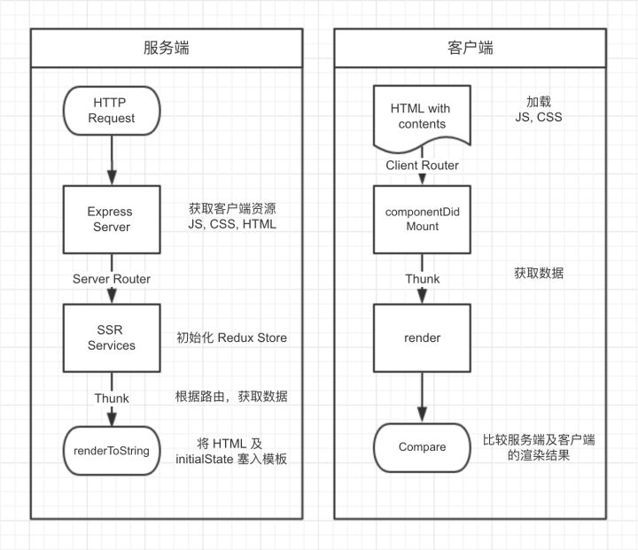

# 服务端渲染与 Universal React App
随着 Webpack 等前端构建工具的普及，客户端渲染因为其构建方便，部署简单等方面的优势，逐渐成为了现代网站的主流渲染模式。而在刚刚发布的 [React v16.0](https://reactjs.org/blog/2017/09/26/react-v16.0.html) 中，改进后更为优秀的服务端渲染性能作为六大更新点之一，被 React 官方重点提及。为此笔者还专门做了一个小调查，分别询问了二十位国内外（国内国外各十位）前端开发者，希望能够了解一下服务端渲染在使用 React 公司中所占的比例。

出人意料的是，十位国内的前端开发者中在生产环境使用服务端渲染的只有三位。而在国外的十位前端开发者中，使用服务端渲染的达到了惊人的八位。

这让人不禁开始思考，同是 React 的深度使用者，为什么国内外前端开发者在服务端渲染这个 React 核心功能的使用率上有着如此巨大的差别？在经过又一番刨根问底地询问后，真正的答案逐渐浮出水面，那就是可靠的 SEO（reliable SEO）。

相比较而言，国外公司对于 SEO 的重视程度要远高于国内公司，在这方面积累的经验也要远多于国内公司，前端页面上需要服务端塞入的内容也绝不仅仅是用户所看到的那些而已。所以对于国外的前端开发者来说，除去公司内部系统不谈，所有的客户端应用都需要做大量的 SEO 工作，服务端渲染也就顺理成章地成为了一个必选项。这也从一个侧面证明了国内外互联网环境的一个巨大差异，即虽然国际上也有诸如 Google，Facebook，Amazon 这样的巨头公司，但放眼整个互联网，这些巨头公司所产生的**黑洞效应**并没有国内 BAT 三家那样如此得明显，中小型公司依然有其生存的空间，搜索引擎所带来的自然流量就足够中小型公司可以活得很好。在这样的前提下，SEO 的重要性自然也就不言而喻了。

除去 SEO，服务端渲染对于前端应用的首屏加载速度也有着质的提升。特别是在 React v16.0 发布之后，新版 React 的服务端渲染性能相较于老版提升了三倍之多，这让已经在生产环境中使用服务端渲染的公司“免费”获得了一次网站加载速度提升的机会，同时也吸引了许多还未在生产环境中使用服务端渲染的开发者。

## 客户端渲染 vs. 服务端渲染 vs. 同构
在深入服务端渲染的细节之前，让我们先明确几个概念的具体含义。

* 客户端渲染：页面在 JavaScript，CSS 等资源文件加载完毕后开始渲染，路由为客户端路由，也就是我们经常谈到的 SPA（Single Page Application）。
* 服务端渲染：页面由服务端直接返回给浏览器，路由为服务端路由，URL 的变更会刷新页面，原理与 ASP，PHP 等传统后端框架类似。
* 同构：英文表述为 Isomorphic 或 Universal，即编写的 JavaScript 代码可同时运行在浏览器及 Node.js 两套环境中，用服务端渲染来提升首屏的加载速度，首屏之后的路由由客户端控制，即在用户到达首屏后，整个应用仍是一个 SPA。

在明确了这三种渲染方案的具体含义后，我们可以发现，不论是客户端渲染还是服务端渲染，都有着其明显的缺陷，而同构显然是结合了二者优点之后的一种更好的解决方案。

但想在客户端写出一套完全符合同构要求的 React 代码并不是一件容易的事，与此同时还需要额外部署一套稳定的服务端渲染服务，这二者相加起来的开发或迁移成本都足以击溃许多想要尝试服务端渲染的 React 开发者的信心。

那么今天就让我们来一起总结下，符合同构要求的 React 代码都有哪些需要注意的地方，以及如何搭建起一个基础的服务端渲染服务。

## 总体架构
为了方便各位理解同构的具体实现过程，笔者基于 `react`，`react-router`，`redux` 以及 `webpack3` 实现了一个简单的[脚手架项目](https://github.com/AlanWei/react-boilerplate-ssr)，支持客户端渲染和服务端渲染两种开发方式，供各位参考。



1. 服务端预先获取编译好的客户端代码及其他资源。
2. 服务端接收到用户的 HTTP 请求后，触发服务端的路由分发，将当前请求送至服务端渲染模块处理。
3. 服务端渲染模块根据当前请求的 URL 初始化 memory history 及 redux store。
4. 根据路由获取渲染当前页面所需要的异步请求（thunk）并获取数据。
5. 调用 renderToString 方法渲染 HTML 内容并将初始化完毕的 redux store 塞入 HTML 中，供客户端渲染时使用。
6. 客户端收到服务端返回的已渲染完毕的 HTML 内容并开始同步加载客户端 JavaScript，CSS，图片等其他资源。
7. 之后的流程与客户端渲染完全相同，客户端初始化 redux store，路由找到当前页面的组件，触发组件的生命周期函数，再次获取数据。唯一不同的是 redux store 的初始状态将由服务端在 HTML 中塞入的数据提供，以保证客户端渲染时可以得到与服务端渲染相同的结果。受益于 Virtual DOM 的 diff 算法，这里并不会触发一次冗余的客户端渲染。

在了解了同构的大致思路后，接下来再让我们对同构中需要注意的点逐一进行分析，与各位一起探讨同构的最佳实践。

## 客户端与服务端构建过程不同
因为运行环境与渲染目的的不同，共用一套代码的客户端与服务端在构建方面有着许多的不同之处。

### 入口（entry）不同
客户端的入口为 `ReactDOM.render` 所在的文件，即将根组件挂载在 DOM 节点上。而服务端因为没有 DOM 的存在，只需要拿到需要渲染的 react 组件即可。为此我们需要在客户端抽离出独立的 `createApp` 及 `createStore` 的方法。

```javascript
// createApp.js

import React from 'react';
import { Provider } from 'react-redux';
import Router from './router';

const createApp = (store, history) => (
  <Provider store={store}>
    <Router history={history} />
  </Provider>
);

export default createApp;
```

```javascript
// createStore.js

import { createStore, combineReducers, applyMiddleware, compose } from 'redux';
import { routerReducer, routerMiddleware } from 'react-router-redux';
import reduxThunk from 'redux-thunk';
import reducers from './reducers';
import routes from './router/routes';

function createAppStore(history, preloadedState = {}) {
  // enhancers
  let composeEnhancers = compose;

  if (typeof window !== 'undefined') {
    // eslint-disable-next-line no-underscore-dangle
    composeEnhancers = window.__REDUX_DEVTOOLS_EXTENSION_COMPOSE__ || compose;
  }

  // middlewares
  const routeMiddleware = routerMiddleware(history);
  const middlewares = [
    routeMiddleware,
    reduxThunk,
  ];

  const store = createStore(
    combineReducers({
      ...reducers,
      router: routerReducer,
    }),
    preloadedState,
    composeEnhancers(applyMiddleware(...middlewares)),
  );

  return {
    store,
    history,
    routes,
  };
}

export default createAppStore;
```

并在 `app` 文件夹中将这两个方法一起输出出去：

```javascript
import createApp from './createApp';
import createStore from './createStore';

export default {
  createApp,
  createStore,
};
```

### 出口（output）不同
为了最大程度地提升用户体验，在客户端渲染时我们将根据路由对代码进行拆分，但在服务端渲染时，确定某段代码与当前路由之间的对应关系是一件非常繁琐的事情，所以我们选择将所有客户端代码打包成一个完整的 js 文件供服务端使用。

理想的打包结果如下：
```text
├── build
│   └── v1.0.0
│       ├── assets
│       │   ├── 0.0.257727f5.js
│       │   ├── 0.0.257727f5.js.map
│       │   ├── 1.1.c3d038b9.js
│       │   ├── 1.1.c3d038b9.js.map
│       │   ├── 2.2.b11f6092.js
│       │   ├── 2.2.b11f6092.js.map
│       │   ├── 3.3.04ff628a.js
│       │   ├── 3.3.04ff628a.js.map
│       │   ├── client.fe149af4.js
│       │   ├── client.fe149af4.js.map
│       │   ├── css
│       │   │   ├── style.db658e13004910514f8f.css
│       │   │   └── style.db658e13004910514f8f.css.map
│       │   ├── images
│       │   │   └── 5d5d9eef.svg
│       │   ├── vendor.db658e13.js
│       │   └── vendor.db658e13.js.map
│       ├── favicon.ico
│       ├── index.html
│       ├── manifest.json
│       └── server (服务端需要的资源将被打包至这里)
│           ├── assets
│           │   ├── server.4b6bcd12.js
│           │   └── server.4b6bcd12.js.map
│           └── manifest.json
```

### 使用的插件（plugin）不同
与客户端不同，除去 JavaScript 之外，服务端并不需要任何其他的资源，如 HTML 及 CSS 等，所以在构建服务端 JavaScript 时，诸如 `HtmlWebpackPlugin` 等客户端所特有的插件就可以省去了，具体细节各位可以参考项目中的 [webpack.config.js](https://github.com/AlanWei/react-boilerplate-ssr/blob/master/client/webpack.config.js)。

### 数据获取方式不同
异步数据获取一直都是服务端渲染做得不够优雅的一个地方，其主要问题在于无法直接复用客户端的数据获取方法。如在 redux 的前提下，服务端没有办法像客户端那样直接在组件的`componentDidMount` 中调用 action 去获取数据。

为了解决这一问题，我们针对每一个 view 为其抽象出了一个 thunk 文件，并将其绑定在客户端的路由文件中。这样我们就可以在服务端通过 `react-router-config` 提供的 `matchRoutes` 方法找到当前页面的 thunk，并在 `renderToString` 之前 dispatch 这些异步方法，将数据更新至 redux store 中，以保证 `renderToString` 的渲染结果是包含异步数据的。

```javascript
// thunk.js
import homeAction from '../home/action';
import action from './action';

const thunk = store => ([
  store.dispatch(homeAction.getMessage()),
  store.dispatch(action.getUser()),
]);

export default thunk;

// createAsyncThunk.js
import get from 'lodash/get';
import isArrayLikeObject from 'lodash/isArrayLikeObject';

function promisify(value) {
  if (typeof value.then === 'function') {
    return value;
  }

  if (isArrayLikeObject(value)) {
    return Promise.all(value);
  }

  return value;
}

function createAsyncThunk(thunk) {
  return store => (
    thunk()
      .then(component => get(component, 'default', component))
      .then(component => component(store))
      .then(component => promisify(component))
  );
}

export default createAsyncThunk;

// routes.js
const routes = [{
  path: '/',
  exact: true,
  component: AsyncHome,
  thunk: createAsyncThunk(() => import('../../views/home/thunk')),
}, {
  path: '/user',
  component: AsyncUser,
  thunk: createAsyncThunk(() => import('../../views/user/thunk')),
}];
```

服务端核心的页面渲染模块：

```javascript
const ReactDOM = require('react-dom/server');
const { matchRoutes } = require('react-router-config');
const { Helmet } = require('react-helmet');
const serialize = require('serialize-javascript');
const createHistory = require('history/createMemoryHistory').default;
const get = require('lodash/get');
const head = require('lodash/head');
const { getClientInstance } = require('../client');

// Initializes the store with the starting url = require( request.
function configureStore(req, client) {
  console.info('server path', req.originalUrl);

  const history = createHistory({ initialEntries: [req.originalUrl] });
  const preloadedState = {};

  return client.app.createStore(history, preloadedState);
}

// This essentially starts passing down the "context"
// object to the Promise "then" chain.
function setContextForThenable(context) {
  return () => context;
}

// Prepares the HTML string and the appropriate headers
// and subequently string replaces them into their placeholders
function renderToHtml(context) {
  const { client, store, history } = context;
  const appObject = client.app.createApp(store, history);
  const appString = ReactDOM.renderToString(appObject);
  const helmet = Helmet.renderStatic();
  const initialState = serialize(context.store.getState(), {isJSON: true});

  context.renderedHtml = client
    .html()
    .replace(/<!--appContent-->/g, appString)
    .replace(/<!--appState-->/g, `<script>window.__INITIAL_STATE__ = ${initialState}</script>`)
    .replace(/<\/head>/g, [
      helmet.title.toString(),
      helmet.meta.toString(),
      helmet.link.toString(),
      '</head>',
    ].join('\n'))
    .replace(/<html>/g, `<html ${helmet.htmlAttributes.toString()}>`)
    .replace(/<body>/g, `<body ${helmet.bodyAttributes.toString()}>`);

  return context;
}

// SSR Main method
// Note: Each function in the promise chain beyond the thenable context
// should return the context or modified context.
function serverRender(req, res) {
  const client = getClientInstance(res.locals.clientFolders);
  const { store, history, routes } = configureStore(req, client);

  const branch = matchRoutes(routes, req.originalUrl);
  const thunk = get(head(branch), 'route.thunk', () => {});

  Promise.resolve(null)
    .then(thunk(store))
    .then(setContextForThenable({ client, store, history }))
    .then(renderToHtml)
    .then((context) => {
      res.send(context.renderedHtml);
      return context;
    })
    .catch((err) => {
      console.error(`SSR error: ${err}`);
    });
}

module.exports = serverRender;
```

在客户端，我们可以直接在 `componentDidMount` 中调用这些 action：

```javascript
const mapDispatchToProps = {
  getUser: action.getUser,
  getMessage: homeAction.getMessage,
};

componentDidMount() {
  this.props.getMessage();
  this.props.getUser();
}
```

在分离了服务端与客户端 dispatch 异步请求的方式后，我们还可以针对性地对服务端的 thunk 做进一步的优化，即只请求首屏渲染需要的数据，剩下的数据交给客户端在 js 加载完毕后再请求。

但这里又引出了另一个问题，比如在上面的例子中，getUser 和 getMessage 这两个异步请求分别在服务端与客户端各请求了一次，即我们在很短的时间内重复请求了同一个接口两次，这是可以避免的吗？

这样的数据获取方式在纯服务端渲染时自然是冗余的，但在同构的架构下，其实是无法避免的。因为我们并不知道用户在访问客户端的某个页面时，是从服务端路由来的（即首屏），还是从客户端路由（首屏之后的后续路由）来的。也就是说如果我们不在组件的 `componentDidMount` 中去获取异步数据的话，一旦用户到达了某个页面，再点击页面中的某个元素跳转至另一页面时，是不会触发服务端的数据获取的，因为这时走的实际上是客户端路由。

## 服务端渲染还能做些什么
除去 SEO 与首屏加速，在额外部署了一套服务端渲染服务后，我们当然希望它能为我们分担更多的事情，那么究竟有哪些事情放在服务端去做是更为合适的呢？笔者总结了以下几点。

### 初始化应用状态
除去获取当前页面的数据，在做了同构之后，客户端还可以将获取应用全局状态的一些请求也交由服务端去做，如获取当前时区，语言，设备信息，用户等通用的全局数据。这样客户端在初始化 redux store 时就可以直接获取到上述数据，从而加快其他页面的渲染速度。与此同时，在分离了这部分业务逻辑到服务端之后，客户端的业务逻辑也会变得更加清晰。当然，如果你想做一个纯粹的 Universal App，也可以把初始化应用状态封装成一个方法，让服务端与客户端都可以自由地去调用它。

### 更早的路由处理
相较于客户端，服务端可以更早地对当前 URL 进行一些业务逻辑上的判断。比如 `404` 时，服务端可以直接将另一个 `error.html` 的模板发送至客户端，用户也就可以在第一时间收到相应的反馈，而不需要等到所有 JavaScript 等客户端资源加载完毕之后，才看到由客户端渲染的 `404` 页面。

### Node.js 中间层
有了服务端渲染这一层后，服务端还可以帮助客户端向 Cookie 中注入一些后端 API 中没有的数据，甚至做一些接口聚合，数据格式化的工作。这时，我们所写的 Node.js 服务端就不再是一个单纯的渲染服务了，而是进化为了一个 Node.js 中间层，可以帮助客户端完成许多在客户端做不到或很难做到的事情。

## 要不要做同构
在分析了同构的具体实现细节并了解了同构的好处之后，我们也需要知道这一切的好处并不是没有代价的，同构或者说服务端渲染最大的瓶颈就是服务端的性能。

在用户规模大到一定程度之后，客户端渲染本身就是一个完美的分布式系统，我们可以充分地利用用户的电脑去运行 JavaScript 中那些复杂的运算，而服务端渲染却将这些工作全部揽了回来并加到了网站自己的服务器上。

所以，考虑到投入产出比，同构可能并不适用于前端需要大量计算（如包含大量图表的页面）且用户量非常巨大的应用，却非常适用于大部分的内容展示型网站，比如知乎就是一个很好的例子。以知乎为例，服务端渲染与客户端渲染的成本几乎是相同的，重点都在于获取用户时间线上的数据，这时多页面的服务端渲染可以很好地加快首屏渲染的速度，又因为运行 `renderToString` 时的计算量并不大，即使用户量很大，也仍然是一件值得去做的事情。

## 小结
结合之前文章中提到的[前端数据层](https://github.com/AlanWei/blog/issues/5)的概念，服务端渲染服务其实是一个很好的前端开发介入服务端开发的切入点，在完成了服务端渲染服务后，对数据接口做一些代理或整合也是非常值得去尝试的工作。

一个代码库之所以复杂，很多时候就是因为分层架构没有做好而导致其中某一个模块过于臃肿，集中了大部分的业务复杂度，但其他模块又根本帮不上忙。想要做好前端数据层的工作，只把眼光局限在客户端是远远不够的，将业务复杂度均分到客户端及服务端，并让两方分别承担各自适合的工作，可能会是一种更好的解法。