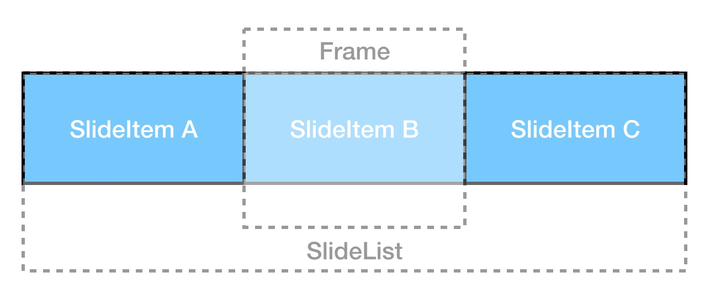
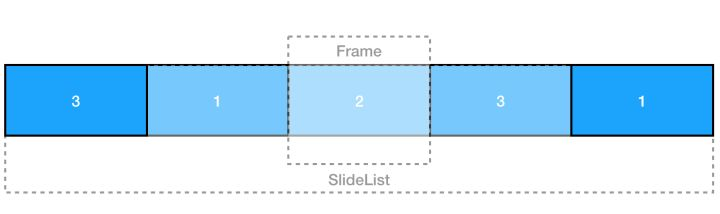
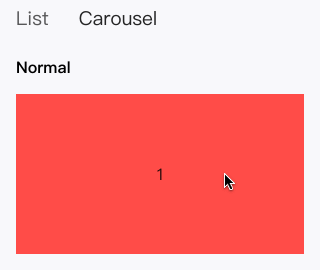
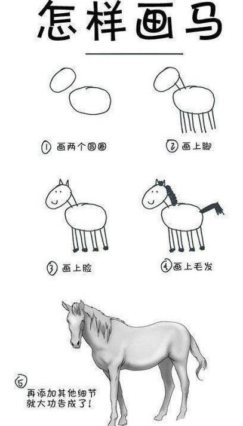

# 组件库设计实战 - 复杂组件设计
一个成熟的组件库通常都由数十个常用的 UI 组件构成，这其中既有按钮（Button），输入框（Input）等基础组件，也有表格（Table），日期选择器（DatePicker），轮播（Carousel）等自成一体的复杂组件。

这里我们提出一个**组件复杂度**的概念，一个组件复杂度的主要来源就是其自身的状态，即组件自身需要维护多少个不依赖于外部输入的状态。参考原先文章中提到过的木偶组件（dumb component）与智能组件（smart component），二者的区别就是是否需要在组件内部维护不依赖于外部输入的状态。

## 实战案例 - 轮播组件
在本篇文章中，我们将以轮播（Carousel）组件为例，一步一步还原如何实现一个交互流畅的轮播组件。

### 最简单的轮播组件
抛去所有复杂的功能，轮播组件的实质，实际上就是在一个固定区域实现不同元素之间的切换。在明确了这点后，我们就可以设计轮播组件的基础 DOM 结构为：

```jsx
<Frame>
  <SlideList>
    <SlideItem />
    ...
    <SlideItem />
  </SlideList>
</Frame>
```

如下图所示：



`Frame` 即轮播组件的真实显示区域，其宽高为内部由使用者输入的 `SlideItem` 决定。这里需要注意的一点是需要设置 `Frame` 的 `overflow` 属性为 `hidden`，即隐藏超出其本身宽高的部分，每次只显示一个 `SlideItem`。

`SlideList` 为轮播组件的轨道容器，改变其 `translateX` 的值即可实现在轨道的滑动，以显示不同的轮播元素。

`SlideItem` 是使用者输入的轮播元素的一层抽象，内部可以是 `img` 或 `div` 等 DOM 元素，并不影响轮播组件本身的逻辑。

### 实现轮播元素之前的切换
为了实现在不同 `SlideItem` 之间的切换，我们需要定义轮播组件的第一个内部状态，即 `currentIndex`，即当前显示轮播元素的 `index` 值。上文中我们提到了改变 `SlideList` 的 `translateX` 是实现轮播元素切换的关键，所以这里我们需要将 `currentIndex` 与 `SlideList` 的 `translateX` 对应起来，即：

```javascript
translateX = -(width) * currentIndex
```

`width` 即为单个轮播元素的宽度，与 `Frame` 的宽度相同，所以我们可以在 `componentDidMount` 时拿到 `Frame` 的宽度并以此计算出轨道的总宽度。

```javascript
componentDidMount() {
  const width = get(this.container.getBoundingClientRect(), 'width');
}

render() {
  const rest = omit(this.props, Object.keys(defaultProps));
  const classes = classnames('ui-carousel', this.props.className);
  return (
    <div
      {...rest}
      className={classes}
      ref={(node) => { this.container = node; }}
    >
      {this.renderSildeList()}
      {this.renderDots()}
    </div>
  );
}
```

至此，我们只需要改变轮播组件中的 `currentIndex`，即可间接改变 `SlideList` 的 `translateX`，以此实现轮播元素之间的切换。

### 响应用户操作
轮播作为一个常见的通用组件，在桌面和移动端都有着非常广泛的应用，这里我们先以移动端为例，来阐述如何响应用户操作。

```javascript
{map(children, (child, i) => (
  <div
    className="slideItem"
    role="presentation"
    key={i}
    style={{ width }}
    onTouchStart={this.handleTouchStart}
    onTouchMove={this.handleTouchMove}
    onTouchEnd={this.handleTouchEnd}
  >
    {child}
  </div>
))}
```

在移动端，我们需要监听三个事件，分别响应滑动开始，滑动中与滑动结束。其中滑动开始与滑动结束都是一次性事件，而滑动中则是持续性事件，以此我们可以确定在三个事件中我们分别需要确定哪些值。

#### 滑动开始
* startPositionX：此次滑动的起始位置

```javascript
handleTouchStart = (e) => {
  const { x } = getPosition(e);
  this.setState({
    startPositionX: x,
  });
}
```

#### 滑动中
* moveDeltaX：此次滑动的实时距离
* direction：此次滑动的实时方向
* translateX：此次滑动中轨道的实时位置，用于渲染

```javascript
handleTouchMove = (e) => {
  const { width, currentIndex, startPositionX } = this.state;
  const { x } = getPosition(e);

  const deltaX = x - startPositionX;
  const direction = deltaX > 0 ? 'right' : 'left';
  this.setState({
    moveDeltaX: deltaX,
    direction,
    translateX: -(width * currentIndex) + deltaX,
  });
}
```

#### 滑动结束
* currentIndex：此次滑动结束后新的 currentIndex
* endValue：此次滑动结束后轨道的 translateX

```javascript
handleTouchEnd = () => {
  this.handleSwipe();
}

handleSwipe = () => {
  const { children, speed } = this.props;
  const { width, currentIndex, direction, translateX } = this.state;
  const count = size(children);

  let newIndex;
  let endValue;
  if (direction === 'left') {
    newIndex = currentIndex !== count ? currentIndex + 1 : START_INDEX;
    endValue = -(width) * (currentIndex + 1);
  } else {
    newIndex = currentIndex !== START_INDEX ? currentIndex - 1 : count;
    endValue = -(width) * (currentIndex - 1);
  }

  const tweenQueue = this.getTweenQueue(translateX, endValue, speed);
  this.rafId = requestAnimationFrame(() => this.animation(tweenQueue, newIndex));
}
```

因为我们在滑动中会实时更新轨道的 translateX，我们的轮播组件便可以做到**跟手**的用户体验，即在单次滑动中，轮播元素会跟随用户的操作向左或向右滑动。

### 实现顺滑的切换动画
在实现了滑动中跟手的用户体验后，我们还需要在滑动结束后将显示的轮播元素定位到新的 `currentIndex`。根据用户的滑动方向，我们可以对当前的 `currentIndex` 进行 +1 或 -1 以得到新的 `currentIndex`。但在处理第一个元素向左滑动或最后一个元素向右滑动时，新的 `currentIndex` 需要更新为最后一个或第一个。

这里的逻辑并不复杂，但却带来了一个非常难以解决的用户体验问题，那就是假设我们有 3 个轮播元素，每个轮播元素的宽度都为 300px，即显示最后一个元素时，轨道的 translateX 为 -600px，在我们将最后一个元素向左滑动后，轨道的 translateX 将被重新定义为 0px，此时若我们使用原生的 CSS 动画：

```css
transition: 1s ease-in-out;
```

轨道将会在一秒内从左向右滑动至第一个轮播元素，而这是反直觉的，因为用户一个向左滑动的操作导致了一个向右的动画，反之亦然。

这个问题从上古时期就困扰着许多前端开发者，笔者也见过以下几种解决问题的方法：

* 将轨道宽度定义为无限长（几百万 px），无限次重复有限的轮播元素。这种解决方案显然是一种 hack，并没有从实质上解决轮播组件的问题。
* 只渲染三个轮播元素，即前一个，当前一个，下一个，每次滑动后同时更新三个元素。这种解决方案实现起来非常复杂，因为组件内部要维护的状态从一个 currentIndex 增加到了三个拥有各自状态的 DOM 元素，且因为要不停的删除和新增 DOm 节点导致性能不佳。

这里让我们再来思考一下滑动操作的本质。除去第一和最后两个元素，所有中间元素滑动后新的 translateX 的值都是固定的，即 `-(width * currentIndex)`，这种情况下的动画都可以轻松地完美实现。而在最后一个元素向左滑动时，因为轨道的 `translateX` 已经到达了极限，面对这种情况我们如何才能实现顺滑的切换动画呢？

这里我们选择将最后一个及第一个元素分别拼接至轨道的头尾，以保证在 DOM 结构不需要改变的前提下实现顺滑的切换动画：



这样我们就统一了每次滑动结束后 `endValue` 的计算方式，即

```javascript
// left
endValue = -(width) * (currentIndex + 1)

// right
endValue = -(width) * (currentIndex - 1)
```

### 使用 requestAnimationFrame 实现高性能动画
`requestAnimationFrame` 是浏览器提供的一个专注于实现动画的 API，感兴趣的朋友可以再重温一下[《React Motion 缓动函数剖析》](https://zhuanlan.zhihu.com/p/20458251)这篇专栏。

所有的动画本质上都是一连串的时间轴上的值，具体到轮播场景下即：以用户停止滑动时的值为起始值，以新 `currentIndex` 时 `translateX` 的值为结束值，在使用者设定的动画时间（如0.5秒）内，依据使用者设定的缓动函数，计算每一帧动画时的 `translateX` 值并最终得到一个数组，以每秒 60 帧的速度更新在轨道的 `style` 属性上。每更新一次，将消耗掉动画值数组中的一个中间值，直到数组中所有的中间值被消耗完毕，动画结束并触发回调。

具体代码如下：

```javascript
const FPS = 60;
const UPDATE_INTERVAL = 1000 / FPS;

animation = (tweenQueue, newIndex) => {
  if (isEmpty(tweenQueue)) {
    this.handleOperationEnd(newIndex);
    return;
  }

  this.setState({
    translateX: head(tweenQueue),
  });
  tweenQueue.shift();
  this.rafId = requestAnimationFrame(() => this.animation(tweenQueue, newIndex));
}

getTweenQueue = (beginValue, endValue, speed) => {
  const tweenQueue = [];
  const updateTimes = speed / UPDATE_INTERVAL;
  for (let i = 0; i < updateTimes; i += 1) {
    tweenQueue.push(
      tweenFunctions.easeInOutQuad(UPDATE_INTERVAL * i, beginValue, endValue, speed),
    );
  }
  return tweenQueue;
}
```

在回调函数中，根据变动逻辑统一确定组件当前新的稳定态值：

```javascript
handleOperationEnd = (newIndex) => {
  const { width } = this.state;

  this.setState({
    currentIndex: newIndex,
    translateX: -(width) * newIndex,
    startPositionX: 0,
    moveDeltaX: 0,
    dragging: false,
    direction: null,
  });
}
```

完成后的轮播组件效果如下图：



### 优雅地处理特殊情况
* 处理用户误触：在移动端，用户经常会误触到轮播组件，即有时手不小心滑过或点击时也会触发 `onTouch` 类事件。对此我们可以采取对滑动距离添加阈值的方式来避免用户误触，阈值可以是轮播元素宽度的 10% 或其他合理值，在每次滑动距离超过阈值时，才会触发轮播组件后续的滑动。
* 桌面端适配：对于桌面端而言，轮播组件所需要响应的事件名称与移动端是完全不同的，但又可以相对应地匹配起来。这里还需要注意的是，我们需要为轮播组件添加一个 dragging 的状态来区分移动端与桌面端，从而安全地复用 handler 部分的代码。

```javascript
// mobile
onTouchStart={this.handleTouchStart}
onTouchMove={this.handleTouchMove}
onTouchEnd={this.handleTouchEnd}
// desktop
onMouseDown={this.handleMouseDown}
onMouseMove={this.handleMouseMove}
onMouseUp={this.handleMouseUp}
onMouseLeave={this.handleMouseLeave}
onMouseOver={this.handleMouseOver}
onMouseOut={this.handleMouseOut}
onFocus={this.handleMouseOver}
onBlur={this.handleMouseOut}

handleMouseDown = (evt) => {
  evt.preventDefault();
  this.setState({
    dragging: true,
  });
  this.handleTouchStart(evt);
}

handleMouseMove = (evt) => {
  if (!this.state.dragging) {
    return;
  }
  this.handleTouchMove(evt);
}

handleMouseUp = () => {
  if (!this.state.dragging) {
    return;
  }
  this.handleTouchEnd();
}

handleMouseLeave = () => {
  if (!this.state.dragging) {
    return;
  }
  this.handleTouchEnd();
}

handleMouseOver = () => {
  if (this.props.autoPlay) {
    clearInterval(this.autoPlayTimer);
  }
}

handleMouseOut = () => {
  if (this.props.autoPlay) {
    this.autoPlay();
  }
}
```

## 小结
至此我们就实现了一个只有 `tween-functions` 一个第三方依赖的轮播组件，打包后大小不过 2KB，完整的源码大家可以参考这里 [carousel/index.js](https://github.com/AlanWei/sea-ui/blob/master/components/carousel/index.js)。

除了节省的代码体积，更让我们欣喜的还是彻底弄清楚了轮播组件的实现模式以及如何使用 `requestAnimationFrame` 配合 `setState` 来在 react 中完成一组动画。

## 感想



大家应该都看过上面这幅漫画，有趣之余也蕴含着一个朴素却深刻的道理，那就是在解决一个复杂问题时，最重要的是思路，但仅仅有思路也仍是远远不够的，还需要具体的执行方案。这个具体的执行方案，必须是连续的，其中不可以欠缺任何一环，不可以有任何思路或执行上的跳跃。所以解决任何复杂问题都没有银弹也没有捷径，我们必须把它弄清楚，搞明白，然后才能真正地解决它。

至此，组件库设计实战系列文章也将告一段落。在全部四篇文章中，我们分别讨论了组件库架构，组件分类，文档组织，国际化以及复杂组件设计这几个核心的话题，因笔者能力所限，其中自然有许多不足之处，烦请各位谅解。

组件库作为提升前端团队工作效率的重中之重，花再多时间去研究它都不为过。再加上与设计团队对接，形成设计语言，与后端团队对接，统一数据结构，组件库也可以说是前端工程师在拓展自身工作领域上的必经之路。

**不要害怕重复造轮子，关键是每造一次轮子后，从中学到了什么。**

与各位共勉。