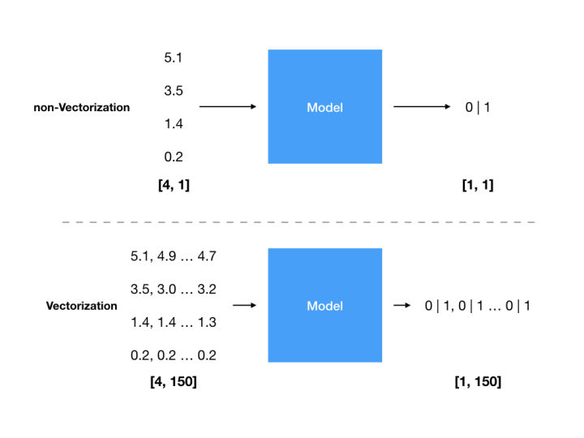

# 写给 Web 开发者的深度学习教程 - 向量化 & 矩阵

## 前言
在这个科技发展日新月异的时代，行业的宠儿与弃儿就如同手掌的两面，只需轻轻一翻，从业者的境遇便会有天翻地覆的改变。

人工智能作为近两年来业界公认的热门领域，不同于之前火热的移动端开发或前端开发，其距离传统软件开发行业之远，入门门槛之高，都是以往不曾出现过的，这也让许多希望能够终身学习，持续关注行业发展的软件工程师们望而却步。

在我们进一步讨论阻止传统软件工程师向人工智能领域转型的障碍之前，让我们先来明确几个名词的定义：

* 人工智能：以机器为载体展现出的人类智能，如图像识别等传统计算机无法完成的工作
* 机器学习：一种实现人工智能的方式
* 深度学习：一种实现机器学习的技术

那么到底是哪些障碍阻止了传统软件工程师进入人工智能领域呢？

* 数学：不同于后端，前端，移动端等不同领域之间的区别，人工智能，或者说我们接下来将要重点讨论的深度学习，是一门以数学为基础的科学。学习它的前置条件，不再是搭建某一个开发环境，了解某一门框架，而是需要去理解一些诸如矩阵，反向传播，梯度下降等数学概念。
* 生态：很久以来，学术界都以 Python 作为其研究的默认语言，创造了如 [NumPy](http://www.numpy.org/)，[Matplotlib](https://matplotlib.org/) 等一系列优秀的科学计算工具。而对于终日与用户界面打交道的 Web 开发者来说，一系列基础工具的缺乏直接导致了哪怕是建立起来一个最基础的深度学习模型都异常困难。

为了解决上面提到的这两个障碍，笔者使用 TypeScript 以零依赖的方式初步完成了一个基于 JavaScript 的深度学习框架：[deeplearning-js](http://www.deeplearning-js.com/)，希望可以以 Web 开发者熟悉的语言与生态为各位提供一种门槛更低的深度学习的入门方式，并将以**写给 Web 开发者的深度学习教程**这一系列文章，帮助各位理解深度学习的基本思路以及其中涉及到的数学概念。

## 整体架构
```text
src/
├── activationFunction // 激活函数
│   ├── index.ts
│   ├── linear.spec.ts
│   ├── linear.ts
│   ├── linearBackward.spec.ts
│   ├── linearBackward.ts
│   ├── relu.spec.ts
│   ├── relu.ts
│   ├── reluBackward.spec.ts
│   ├── reluBackward.ts
│   ├── sigmoid.spec.ts
│   ├── sigmoid.ts
│   ├── sigmoidBackward.spec.ts
│   ├── sigmoidBackward.ts
│   ├── softmax.spec.ts
│   ├── softmax.ts
│   ├── softmaxBackward.spec.ts
│   └── softmaxBackward.ts
├── costFunction // 损失函数
│   ├── crossEntropyCost.spec.ts
│   ├── crossEntropyCost.ts
│   ├── crossEntropyCostBackward.spec.ts
│   ├── crossEntropyCostBackward.ts
│   ├── index.ts
│   ├── quadraticCost.spec.ts
│   ├── quadraticCost.ts
│   ├── quadraticCostBackward.spec.ts
│   └── quadraticCostBackward.ts
├── data // 数据结构：矩阵 & 标量
│   ├── Array2D.spec.ts
│   ├── Array2D.ts
│   ├── Scalar.spec.ts
│   ├── Scalar.ts
│   └── index.ts
├── index.ts
├── math // 计算：矩阵计算函数 & 生成随机数矩阵 & 生成零矩阵
│   ├── add.spec.ts
│   ├── add.ts
│   ├── divide.spec.ts
│   ├── divide.ts
│   ├── dot.spec.ts
│   ├── dot.ts
│   ├── index.ts
│   ├── multiply.spec.ts
│   ├── multiply.ts
│   ├── randn.spec.ts
│   ├── randn.ts
│   ├── subtract.spec.ts
│   ├── subtract.ts
│   ├── transpose.spec.ts
│   ├── transpose.ts
│   ├── zeros.spec.ts
│   └── zeros.ts
├── model // 模型：初始化参数 & 正向传播 & 反向传播 & 更新参数
│   ├── Cache.ts
│   ├── backPropagation.ts
│   ├── forwardPropagation.ts
│   ├── index.ts
│   ├── initializeParameters.spec.ts
│   ├── initializeParameters.ts
│   ├── train.ts
│   └── updateParameters.ts
├── preprocess // 数据预处理：数据标准化
│   ├── index.ts
│   └── normalization
│       ├── index.ts
│       ├── meanNormalization.spec.ts
│       ├── meanNormalization.ts
│       ├── rescaling.spec.ts
│       └── rescaling.ts
└── utils // 帮助函数：数据结构转换 & 矩阵广播
    ├── broadcasting.spec.ts
    ├── broadcasting.ts
    ├── convertArray1DToArray2D.ts
    ├── convertArray2DToArray1D.ts
    └── index.ts
```

作为一个专注于深度学习本身的框架，deeplearning-js 只负责构建及训练深度学习模型，使用者可以使用提供的 API 在任意数据集的基础上搭建深度学习模型并获得训练后的结果，具体的例子各位可以参考 [Logistic regression](http://www.deeplearning-js.com/demos/logistic)。

我们将学习率，迭代次数，隐藏层神经元个数等这些[超参数](https://en.wikipedia.org/wiki/Hyperparameter)暴露给终端用户，deeplearning-js 会自动调整模型，给出不同的输出。基于这些输出，我们就可以自由地使用任意图表或可视化库来展现模型训练后的结果。

另外，大家在阅读本系列文章的同时，建议配合着 deeplearning-js 的[源码](https://github.com/AlanWei/deeplearning-js)一起阅读，相信这样的话，你将会对深度学习到底在做一件什么样的事情有一个更感性的认识。

## 向量化
不同于其他的机器学习教程，我们并不希望在一开始就将大量拗口的数学名词及概念灌输给大家，相反，我们将从训练深度学习模型的第一步数据处理讲起。

让我们以学术界非常著名的 [Iris](https://en.wikipedia.org/wiki/Iris_flower_data_set) 数据集为例。

现在我们拥有了 150 个分别属于 3 个品种的鸢尾属植物的花萼长度，宽度及花瓣长度，宽度的样本数据，目的是训练一个输入任意一个鸢尾属植物的花萼长度，宽度及花瓣长度，宽度，判断它是否是这 3 个品种中的某一个品种，即逻辑回归。

虽然我们的最终模型是输入任意一个样本数据得到结果，但我们在训练时，并不希望每次只能够输入一个样本数据，而是希望一次性地输入所有样本数据，得到训练结果与实际结果的差值，然后使用反向传播来修正这些差异。

于是我们就需要将多个样本数据组合成一个矩阵，如下图所示：



在将数据向量化后，我们才有了处理大数据集的能力，即在整个数据集上而不是在某个数据样本上训练模型。这也是为什么在深度学习领域，GPU 比 CPU 要快得多的原因。在训练深度学习模型时，所有的计算都是基于矩阵的，于是并行计算架构（处理多任务时计算时间等于最复杂任务的完成时间）的 GPU 就要比串行计算架构（处理多任务时计算时间等于所有任务运行时间的总和）的 CPU 快得多。

细心的读者可能会观察到上图中的一个数据样本中的不同维度的数据是竖排列的，这与传统数组中数据的横排列方式恰好相反，即我们需要将

```javascript
[5.1, 3.5, 1.4, 0.2]
```

转换为

```javascript
[
  [5.1],
  [3.5],
  [1.4],
  [0.2],
]
```

细心的读者可能又会问了，如 Iris 数据集，为什么一定要将初始数据转换为 4 行 150 列的矩阵，用方便处理的 150 行 4 列的矩阵不可以吗？

对于这个问题有以下两方面的考虑。在接下来输入数据与隐藏层做矩阵点乘时


隐藏层矩阵（W）的列数需要等于输入层（A）的行数，所以为了减少不必要的计算量，我们希望输入层的行数尽可能得小，于是我们将数据样本的维度数与样本数量进行对比，不难得出在绝大多数情况下，数据样本的维度数都远远小于样本数量这个结论。另一方面，在点乘之后，结果矩阵的列数将等于输入层的列数，也就是说如果我们希望我们的输出是一个 [X, 150] 的矩阵，输入层就需要是一个 [4, 150] 的矩阵。

那么如何快速地在原始数据集与使用数据集之间进行这样的转换呢？这就涉及到矩阵的一个常用运算，矩阵转置了。

## 矩阵
说起矩阵，它的许多奇怪的特性，如转置，点乘等，想必是许多朋友大学时代的噩梦。在这里我们不谈具体的数学概念，先尝试用几句话来描述一下矩阵及它的基础运算。

从最直观的角度来讲，确定一个矩阵需要哪些信息？一是矩阵的形状，即坐标系（空间），二是矩阵在这个坐标系下各个维度上的值（位置）。

* 矩阵（Array2D）：N 维空间中的一个物体，在每一维度上都有其确定的位置
* 矩阵相加（add）：在某一维度或多个维度上对原物体进行拉伸
* 矩阵相减（subtract）：在某一维度或多个维度上对原物体进行裁剪
* 矩阵相乘（multiply）：基于原物体的某一个原点对原物体进行等比放大
* 矩阵相除（divide）：基于原物体的某一个原点对原物体进行等比缩放
* 矩阵转置（transpose）：基于原物体的原点对原物体进行翻转
* 矩阵点乘（dot）：对原物体进行左边矩阵所描述的位置转换，即移动

在 deeplearning-js 中我们使用二维数组的数据结构来表示矩阵，对于上述运算的具体代码实现各位可以参考 [Array2D](https://github.com/AlanWei/deeplearning-js/blob/master/src/data/Array2D.ts)。

一个简单的数据转换的例子如下：

```javascript
function formatDataSet(dataset: Array<any>) {
  const datasetSize = dataset.length;
  let inputValues: Array<number> = [];

  map(dataset, (example: {
    "sepalLength": number,
    "sepalWidth": number,
    "petalLength": number,
    "petalWidth": number,
    "species": string,
  }) => {
    const input: any = omit(example, 'species');
    inputValues = inputValues.concat(values(input));
  });

  const input = new Array2D(
    [datasetSize, inputValues.length / datasetSize],
    inputValues,
  ).transpose();

  return input;
}
```

## 小结
在理解了数据向量化及矩阵的概念后，相信大家已经可以将大样本量，以数组形式存储的数据转换为适合进行深度学习模型训练的大型矩阵了，接下来让我们从如何初始化参数开始，一步步搭建我们的第一个深度学习模型。