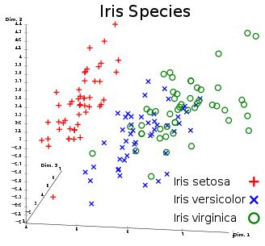
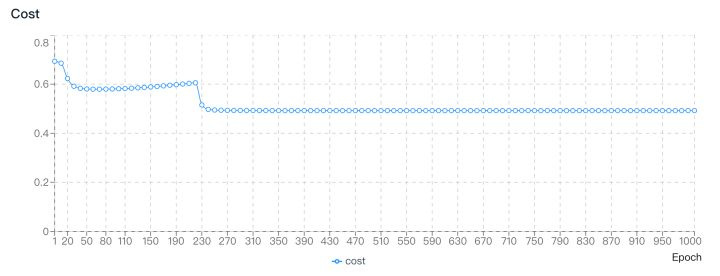
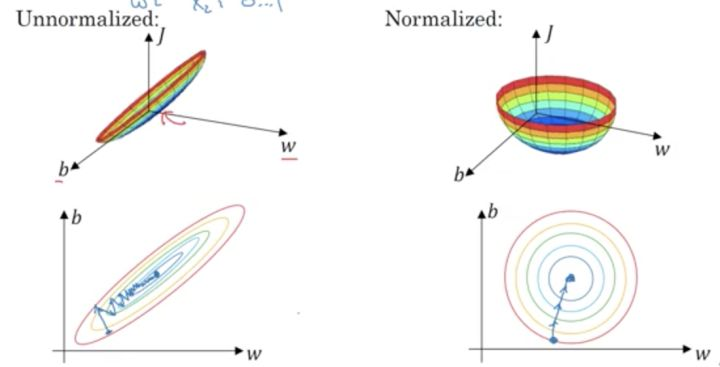
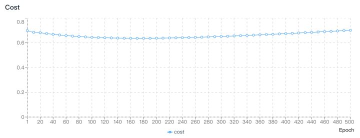
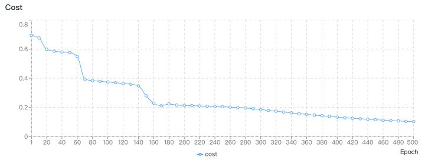
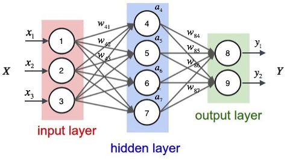

# 写给 Web 开发者的深度学习教程 - 数据标准化 & 参数初始化
在[上一篇文章](https://github.com/AlanWei/blog/issues/7)中，我们介绍了如何将以数组形式存储的数据转换为适合进行深度学习模型训练的大型矩阵，以及矩阵的相关运算。向量化是一切矩阵运算的基础，从编码的角度来讲，可以帮助模型在每一次训练时省下一次与样本数量相等的 for 循环的计算量，即模型可以处理的数据结构将由一维数组升级为二维数组（矩阵）。

## 统计学与机器学习
在 [Tensorflow](https://www.tensorflow.org/)，[PyTorch](http://pytorch.org/) 等机器学习框架逐渐成为主流的今天，再回过头去谈论统计学好像已经有些过时了。正如现在数据岗位的从业者更愿意把自己称为数据科学家而不是数据分析师那样，统计学好像已经在强大的机器学习面前败下阵来。但事实真的是这样吗？对于所有的数据问题，机器学习都是一种比统计学更为优秀的选择吗？

在回答这个问题之前，让我们先来回答一个更为基础的问题，对于一个分类问题来说，是数据集越小越好分类，还是数据集越大越好分类？

从常识的角度来讲，当然是数据集越小越好分类，因为假设极端情况下只有两个样本，那么一定能在空间中划出一条线将二者分开，但是如果有几万个，甚至几百万个样本，好像就很难找出这样一条分割线了。

但另一方面，许多机器学习结合大数据的优秀案例就摆在我们面前，它们都证明了只有数据样本足够大，才能够训练出一个较为准确的模型。

让我们以上一篇专栏中提到的 Iris 数据集为例。



从上图中我们可以看出，setosa 品种和 versicolor，virginica 品种之间的差别非常大，而后两个品种之间相对来讲就显得非常难以区分。

假设我们现在想要训练一个深度学习模型来判断一朵花是不是 versicolor 品种，你会发现无论如何调整学习率，训练次数，隐藏层神经元个数，都很难得到一个收敛的结果，常见的损失函数的图像如下图所示：



> 学习率：0.01，训练次数：1000，隐藏层神经元：10

这证明了在 Iris 数据集的原始空间中，versicolor 与 virginica 几乎是不可分的（有重叠的部分），也就是说在原始空间中，无论你划一条多么复杂的曲线都无法做到一边是 versicolor，另一边是 virginica。

面对这样的结果，当初笔者在使用 [deeplearning-js](http://www.deeplearning-js.com/) 训练第一个模型时内心是崩溃的，无数次地怀疑是代码某个地方出错导致了模型不收敛。

直到后来与一位数据分析领域的朋友聊天时，才了解到原来神经网络在小样本量的数据集上表现并不好。因为神经网络算法跳过了传统统计方法中特征选择的过程，直接暴力地在样本空间进行搜索，试图找出一条曲线将样本分类。这在大样本量，超高纬度的数据集上，效果是非常好的，因为这些数据集本身信息量就非常丰富，简单来讲这样的数据集在超高维空间中样本是可分的。

再举一个可能不太恰当的生活中的例子。要将两百万个苹果分成两类，如果你能准确地捕捉到这两百万个苹果的所有信息，那么你一定能够利用所有的这些信息，找到一些特征将这两百万个苹果分类，换句话说想要找到两百万个非常相似的苹果几乎是不可能的，所以它们一定是可分的。但如果是将二十个苹果进行分类，那么最快速的方法是找一个苹果专家（领域知识），从某几个特定的维度上对这二十个苹果进行分类，但也有可能在极端情况下，这二十个苹果就是非常相似导致完全不可分。

上述例子中的苹果专家就代表着传统的统计学，统计学中有许多如主成分分析（[PCA](https://en.wikipedia.org/wiki/Principal_component_analysis)）等帮助数据降维的方法。对于传统统计学来说，高纬度的数据集是无法处理的，光是数据降纬的过程就十分漫长，而且在数据降纬的过程中，还会丢失掉许多原始数据集中包含的信息。

机器学习则恰好相反，借助于 GPU 超高的运算效率，它试图在一个超高维空间捕捉所有可利用的信息，并最终拟合出一个可用的模型。于是我们也就不难理解，为什么机器学习在处理非结构化数据（如图片，文字，语音等）方面表现比结构化数据更为优秀，其根本原因就是这些非结构化数据本身携带的信息量就非常丰富。如一张 256*256 像素的图片，其本身就是一个 65,536 维的数据，更别提现在一个普通手机就可以拍出动辄几千乘以几千像素的照片了。

到这里，我们应该可以对于开始提出的那个问题，即数据集越小越好分类，还是数据集越大越好分类，给出一个较为准确的答案，那就是在你的运算能力范围之内，一定是数据集越大越好分类，每个样本的维度越多越好分类。

## 数据标准化
在了解了统计学与机器学习的异同之后，我们能不能从统计学中借鉴一些优秀的数据处理方法来优化深度学习模型呢？当然可以。

**数据标准化**就是其中一个非常有效的方法，目前 [deeplearning-js](http://www.deeplearning-js.com/) 支持两种数据标准化的方式：

[Feature scaling](https://github.com/AlanWei/deeplearning-js/blob/master/src/preprocess/normalization/minMaxNormalization.ts):


[Standard score](https://github.com/AlanWei/deeplearning-js/blob/master/src/preprocess/normalization/zscore.ts):


数据标准化的意义又是什么呢？我们来看下图：



简单来说，数据标准化就是在不了解数据各个维度之间的关系时，强行将各个维度拉到相同权重的一种统计学方法。从空间变换的角度来讲，数据标准化可以将扁平空间变换为类圆形空间，不仅可以消除不同维度的权重对目标函数的影响，还可以加快后续梯度下降的速度，避免其在某一巨大的平面上以非常缓慢的速度下降。

让我们来对比一下未开启数据标准化和开启数据标准化的 Iris 数据集在 deeplearning-js 中的表现：

未开启数据标准化：



> 未开启数据标准化，学习率：0.01，训练次数：500，隐藏层神经元：200

模型将所有样本都判定为不是 versicolor，即完全无法区分三种类别。

开启数据标准化：



> 开启数据标准化，学习率：0.01，训练次数：500，隐藏层神经元：200

在 150 个样本中，模型可以正确判断 142 个，即只有小部分的 versicolor 与 virginica 仍无法被正确区分。我们可以通过增加训练次数的方式去继续逼近 100% 的准确率，但从第一张 Iris 数据集的分布图我们可以看出，一部分 versicolor 与 virginica 的样本几乎是重合的，所以即使在进行了空间变换后，想要区分他们的难度依然很大。

我们使用的隐藏层神经元个数也证明了这点，想要用数量很少的神经元个数去区分 versicolor 与 virginica 几乎是不可能的，这也说明即使在变换后的四维空间中也要划一条非常复杂的曲线才可以将这两个品种区分开来。

## 参数初始化
在对数据集进行了预处理之后，让我们正式开始搭建第一个深度学习模型。

如下图所示，深度学习模型就是由这样一层一层的神经网络构成的：



用公式来表示：


以 Iris 数据集为例，我们的输入层是一个 [4, 150] 的矩阵，那么第一个隐藏层的权重值矩阵 W 就需要是一个 [x1, 4] 的矩阵，使得两个矩阵可以进行点乘计算，这里的 x1 就是第一个隐藏层的神经元个数。经过第一个层之后，输出变为了一个 [x1, 150] 的矩阵，也就是说下一个隐藏层的权重矩阵形状应当是 [x2, x1]，列数与前一层相同，行数取决于这一层的神经元个数。以此类推，因为每一层隐藏层的列数都等于前一层的行数，所以我们在初始化参数时就只需要输入当前层的神经元个数即可。

另一方面，因为偏置 b 与 W·A 之间是加法计算，那么就意味着 b  的形状需要与 W·A 相同。

从几何空间的角度来说，如果 W 是空间中一条复杂曲线， b 则可以帮助这条曲线进行平移，使得最终的曲线不必要必须经过原点，从而对数据集进行更准确的拟合。

以 deeplearning-js 中 `initializeParameters` API 为例：

```javascript
const initialParameters = initializeParameters([{
  size: trainSet.input.shape[0], // 输入层神经元个数等于原始输入数据集的行数，即输入数据维度数
}, {
  size: 10, // 第一个隐藏层神经元个数
  activationFunc: 'relu', // 第一个隐藏层激活函数
}, {
  ... // 第 N 个隐藏层
}, {
  size: trainSet.output.shape[0], // 输出层神经元个数等于原始输出数据集的行数，即输出数据维度数
  activationFunc: 'sigmoid', // 输出层激活函数
}],
  0,      // 初始化权重值时使用的平均数，默认为 0
  1,      // 初始化权重值时使用的方差，默认为 1
  0.01,   // 初始化权重值时使用的比例，默认为 1，建议使用 0.01 防止数值膨胀得过快
);

/*
initialParameters = {
  W1: Array2D,
  b1: Array2D,
  W2: Array2D,
  b2: Array2D,
  ...
  Wl: Array2D, // 第 l 层
  bl: Array2D, // 第 l 层
}
*/
```

## 小结
在了解了如何对数据进行必要的预处理并根据需要设计深度学习模型结构后，是时候将数据输入到我们的模型中，让模型真正运转起来了。在下一篇文章中，我们将讲到正向传播，以及隐藏层常用的激活函数，敬请期待。